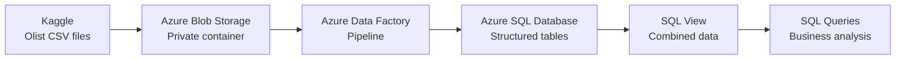
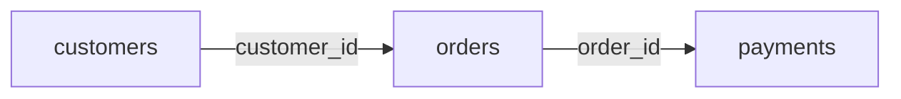

# Olist Azure Data Pipeline

>revisar
* No hay capturas de pantalla???
* REVISAR NOMBRE DE LOS SCRIPTS Y VER SI TODOS ESTÁN EN LA ODCUMENTAICÓN
* Leer todo y ver si es entendible
>revisar
## Project Overview
This project creates an end-to-end data pipeline in Azure using part of the Brazilian E-Commerce Public Dataset by Olist, available on Kaggle.

The original CSV files are stored in a private Azure Blob Storage container. Azure Data Factory loads the data into Azure SQL Database, where three tables are joined in a SQL view for analysis.

**Objective:** To create a reliable and organized data pipeline using Azure services.

## Table of Contents
-  [Dataset](#dataset)
- [Solution Architecture](#solution-architecture)
- [Implementation Process](#implementation-process)
  - [1. Azure Blob Storage](#1-azure-blob-storage)
  - [2. Azure SQL Database](#2-azure-sql-database)
  - [3. Azure Data Factory Pipeline](#3-azure-data-factory-pipeline)
  - [4. Analytical View and Business Analysis](#4-analytical-view-and-business-analysis)
    - [4.1 Data Validation](#data-validation)
    - [4.2 Analytical View](#analytical-view)
    - [4.3 Business Analysis](#business-analysis)
    - [4.4 Results](#results)
  - [5. Production Improvements](#5-production-improvements)
- [Conceptual Questions](#conceptual-questions)
- [AI Usage Disclosure](#ai-usage-disclosure)
- [Repository Structure](#repository-structure)

## Dataset
The project uses the [Brazilian E-Commerce Public Dataset by Olist](https://www.kaggle.com/datasets/olistbr/brazilian-ecommerce), available on Kaggle. It contains anonymized information about approximately 100,000 orders placed in Brazil between 2016 and 2018.

**Files Used:**

- `olist_customers_dataset.csv` - Customer identifiers and location data (99,441 records)
- `olist_orders_dataset.csv` - Order status and purchase dates (99,441 records)
- `olist_order_payments_dataset.csv` - Payment methods, installments, and payment values (103,886 records)

The payments file contains more records because an order can have more than one payment.

>**Note:** The original CSV files are not included in this repository. They can be downloaded directly from Kaggle.

## Solution Architecture


- Three CSV files were manually downloaded from Kaggle and uploaded to the `raw` directory in a private Blob Storage container.
- The Azure SQL tables were created before the pipeline because they were required as the destination tables.
- Azure Data Factory loaded each CSV file into its corresponding SQL table.
- After the data was loaded, the `vw_sales` view joined the three tables and was used for the business queries.

A resource group named `rg-olist-data-pipeline` was created to organize all Azure resources used in the project.

## Implementation Process
### 1. Azure Blob Storage
A Storage Account was created to store the source files. Inside it, a private Blob Storage container named `ecommerce` was created, and anonymous access was disabled.

The container was organized as follows:

```text
ecommerce/
├── raw/
│   ├── olist_customers_dataset.csv
│   ├── olist_orders_dataset.csv
│   └── olist_order_payments_dataset.csv
└── processed/
    └── README.txt
```
The `raw` path contains the original CSV files used as the source for the Azure Data Factory pipeline.

The `processed` path was reserved for possible transformed files in the future. Since Blob Storage does not keep empty virtual folders, a small `README.txt` file was added to keep the path visible.

### 2. Azure SQL Database
An Azure SQL logical server named `sql-server-olist-data` and a database named `sql-db-olist` were created to store the Olist data.

Three tables were created in the `dbo` schema to store the data loaded from each CSV file:

| Destination table in Azure SQL | Source CSV file | Stored data |
|---|---|---|
| `dbo.customers` | `olist_customers_dataset.csv` | Customer identifiers and locations |
| `dbo.orders` | `olist_orders_dataset.csv` | Order status and dates |
| `dbo.payments` | `olist_order_payments_dataset.csv` | Payment details and values |

 The table columns and data types were defined according to the structure of each source file. The complete SQL script is available in [`sql/01_create_tables.sql`](sql/01_create_tables.sql).

### 3. Azure Data Factory Pipeline
Azure Data Factory was used to load the data from Blob Storage into Azure SQL Database.

Two Linked Services were created:

| Linked Service | Purpose |
|---|---|
| `ls_blob_olist` | Connects Data Factory to Azure Blob Storage |
| `ls_sql_olist` | Connects Data Factory to Azure SQL Database |

Six datasets were created to identify the three source files and their destination tables:

| Source dataset | Destination dataset |
|---|---|
| `ds_blob_customers` | `ds_sql_customers` |
| `ds_blob_orders` | `ds_sql_orders` |
| `ds_blob_payments` | `ds_sql_payments` |

The `pl_load_olist_data` pipeline contains three Copy Activities:

- `copy_customers`
- `copy_orders`
- `copy_payments`

Each activity reads one CSV file from the `raw` path and loads its data into the corresponding SQL table. The columns were mapped to match the structure and data types of the destination tables.

The following settings were also included:

- The order dates were converted from text to SQL `DATETIME` using the `yyyy-MM-dd HH:mm:ss` format.
- Before each load, `TRUNCATE TABLE` clears the destination table. This prevents duplicate records when the pipeline runs again. This also means that all three files are loaded again during every execution.

The pipeline was tested with Debug and then published. It was executed manually using `Trigger now`, and the three Copy Activities showed a `Succeeded` status in Monitor.

### 4. Analytical View and Business Analysis 
#### Data Validation 

After the pipeline finished, the data was validated in Azure SQL to confirm that all records were loaded.

| Table | Loaded records |
|---|---:|
| `dbo.customers` | 99,441 |
| `dbo.orders` | 99,441 |
| `dbo.payments` | 103,886 |

The following checks were performed:

- The loaded record counts were compared with the source files.
- The order dates were confirmed to range from September 2016 to October 2018.

The validation queries are available in [`sql/02_data_validation.sql`](sql/02_data_validation.sql).

#### Analytical View
The `dbo.vw_sales` view was created to combine information from the `dbo.customers`, `dbo.orders`, and `dbo.payments` tables for the business analysis.

The diagram shows the fields used to join the tables:


Since one order can have multiple payments, it may appear in more than one row in the view.

The SQL script used to create the view is available in [`sql/03_create_view.sql`](sql/03_create_view.sql).

#### Business Analysis
The four required business queries were performed using the `dbo.vw_sales` view:

| Analysis | Calculation |
|---|---|
| Sales by state | Sum of `payment_value` grouped by `customer_state` |
| Orders by state | Count of distinct `order_id` grouped by `customer_state` |
| Monthly sales | Sum of `payment_value` grouped by purchase year and month |
| Average order value | Average of the total payment value calculated for each order |

The complete SQL queries are available in [`sql/04_business_queries.sql`](sql/04_business_queries.sql).

#### Results

| Metric | Result |
|---|---|
| State with the highest sales | SP: $5,998,226.96 |
| State with the highest number of orders | SP: 41,745 orders |
| Month with the highest sales | November 2017: $1,194,882.80 |
| Average order value | 160.99 |

### 5. Production Improvements

The current solution includes manual steps and loads all the data again during each execution. If the process were performed regularly, the following improvements could be added:

- Automate the transfer of source files to Blob Storage.
- Add a Schedule Trigger to run the pipeline at a defined time.
- Process only files that have not been loaded before.
- Use a control table to record the file name, processing date, and load status.
- Send a notification when the pipeline fails.
- Protect the database credentials using Azure Key Vault or Managed Identity.

## Conceptual Questions

### 1. Why would you use Azure Storage to store the original files?
Azure Storage can store large amounts of data in one place and allows other Azure services to access it. It can grow as the number or size of the files increases, and the files can be kept private. Keeping the original files without changes also makes it possible to check the data or run the pipeline again if needed.

### 2. What is the difference between Azure Blob Storage and Azure Data Lake Storage Gen2?

Azure Blob Storage is used to store files and other types of data as objects. It normally uses a flat structure, so the folders shown in the container are virtual. Azure Data Lake Storage Gen2 is based on Blob Storage, but it adds a hierarchical structure with real directories and more detailed permissions. It is more useful for large data analytics projects with many files and folders.

Blob Storage was enough for this project because it only used three CSV files and a simple folder structure.

### 3. What is a Linked Service in Azure Data Factory?

A Linked Service is the connection between Azure Data Factory and another service. It includes the information needed to access that service, such as the server address and authentication method.

In this project, one Linked Service connected Data Factory to Blob Storage, and another connected it to Azure SQL Database.

### 4. What is a Dataset in Azure Data Factory?
A Dataset identifies the specific data that Data Factory uses as a source or destination. It uses a Linked Service to access the place where the data is stored.

In this project, the source datasets identified the CSV files in Blob Storage, while the destination datasets identified the tables in Azure SQL Database.

### 5. What is the difference between a pipeline and an activity in Azure Data Factory?
A pipeline organizes a complete data process and can contain one or more activities. An activity is one specific action inside a pipeline, such as copying data or checking metadata.

In this project, `pl_load_olist_data` is the pipeline, while `copy_customers`, `copy_orders`, and `copy_payments` are its activities.

### 6. How would you protect Azure SQL Database credentials?
I would avoid storing credentials directly in pipelines, code, documentation, or repositories. In a production environment, I would use Managed Identity so that Data Factory could connect to Azure SQL Database without storing a password.

If SQL Authentication were required, I would store the credentials in Azure Key Vault. In this assessment, I used SQL Authentication but kept the credentials out of the scripts, screenshots, and repository.

### 7. What is Managed Identity?
Managed Identity is an identity created and managed by Azure for an Azure resource. It allows the resource to connect to another Azure service without storing a username or password. The identity still needs permission to access the service.

For example, in a production version of this project, Data Factory could use Managed Identity to connect to Blob Storage or Azure SQL Database.

### 8. How would you monitor a failed execution in Azure Data Factory?
I would use the Monitor section to find the failed pipeline run. Then, I would check which activity failed and read the error message to understand the problem. After fixing the issue, I would run the pipeline again and check the results in Azure SQL Database.

For a regular process, I would also add a notification for pipeline failures.

### 9. What would you do if this process had to run every day?

I would automate the transfer of the source files to Blob Storage and add a Schedule Trigger to run the pipeline every day. I would process only new files and use a control table to record which files were loaded successfully. I would also add a notification in case the pipeline failed.

### 10. How would you avoid reprocessing files that have already been loaded?

I would use a control table to record the file name, processing date, and load status. Before loading a file, the pipeline would check this table to see if the file had already been processed successfully. If it had, the pipeline would skip it. After a successful load, the file information would be added to the control table.

## AI Usage Disclosure
I created and configured the Azure resources, built and ran the pipeline, executed and validated the SQL queries, created the GitHub repository, and wrote the README in Markdown.

I used ChatGPT as a learning and support tool to understand Azure concepts, solve configuration errors, and improve the documentation. I reviewed its suggestions and made the final decisions before including them in the project.

## Repository Structure

```

- `README.md` contains the project explanation, architecture, results, and conceptual answers.
- `sql/` contains the table creation, analytical view, validation, and business query scripts.
- `docs/screenshots/` contains selected evidence of the Azure implementation and SQL results.